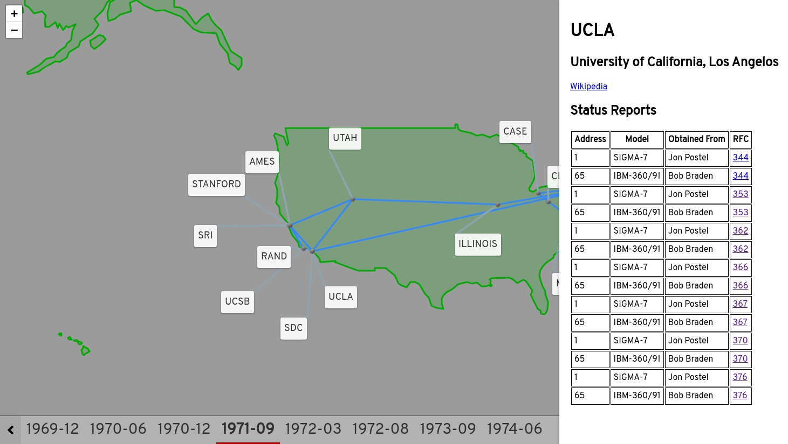

# Arpanet Map



## Background

During my Fall 2019 semester of college, I became particularly interested in
one of the most significant predecessors to the internet as we know it today.

I wanted to make a visualization of how Arpanet changed over the years.

When picking a format to represent the data, I didn't find a schema that
perfectly suited my needs, so I decided to write my own using SQL. However,
there are other great formats that suit various needs for me. For example,
GeoJSON is great for displaying geographical data. GeoJSON integrates with
Leaflet.js and other front-end frameworks to display maps with minimal work.
For this reason, I have written scripts to build GeoJSON from my SQL schema.
Some data is lost, but this is for display only, so it's okay. The master copy
of the data is still stored via SQL.

## Building the Static Website

Start mysql populated with the Arpanet data.

```bash
docker run \
  --rm -it -p 3306:3306 \
  --mount "type=bind,src=$PWD/arpanet.sql,dst=/docker-entrypoint-initdb.d/arpanet.sql" \
  --env MYSQL_ROOT_PASSWORD=password \
  --env MYSQL_DATABASE=arpanet \
  mysql
```

Install node.js 12.x.

Install the node.js dependencies.

```bash
yarn install
```

Build the GeoJSON files.

```bash
yarn buildMaps
```

Start the local development server

```bash
yarn start
```

This project was bootstrapped with `create-react-app`. See the [original README.md](docs/create_react_app.md) form more information.

## Appendix

### Viewing and Editing the Database

Using [mysqlsh][mysqlsh]

```bash
mysqlsh root:password@localhost:3306/arpanet --sql
```

[mysqlsh]: https://dev.mysql.com/doc/mysql-shell/en/mysqlsh.html
